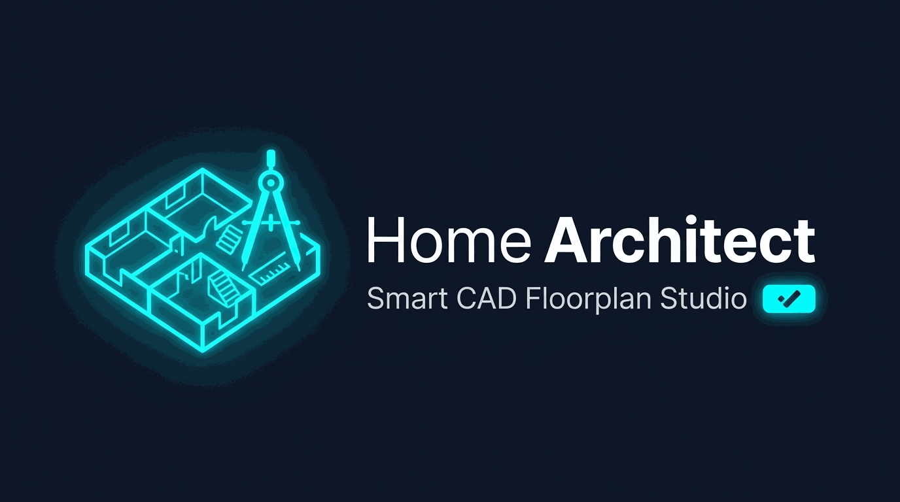

<p align="center">
  
</p>

<p align="center">
  <strong>Le studio de CAO et de plans d'étage interactifs pour Home Assistant & Lovelace</strong><br/>
  <em>Concevez, meublez, cotez et animez vos plans en 2D/3D directement dans votre navigateur.</em>
</p>

<p align="center">
  
  
  
  
  <a href="https://buymeacoffee.com/Socrate"></a>
</p>

---
## 🌟 Fonctionnalités

* **Nouveau plan & Réinitialisation sécurisée (Reset)** :
  * **Créer un nouveau plan (`📄 Nouveau plan...` ou `Ctrl+N` / `Cmd+N`)** : dialogue assisté pour nommer le plan et choisir son niveau ou sa catégorie (RDC, Sous-Sol, Étages, Jardin, Autre) avec réinitialisation de la feuille et recentrage automatique.
  * **Effacer le plan (`🗑️ Effacer le plan (Reset)...`)** : dialogue de confirmation avec récapitulatif des éléments supprimés (murs, ouvrants, pièces, entités, meubles, calque de fond) et sécurité totale via l'historique d'annulation (`Ctrl+Z`).
* **Fonction « Mettre à l'échelle » (Recalcul automatique de toutes les cotes)** :
  * Outil de référence dédié (`📐` ou touche `S`) : sélectionnez un mur ou tracez un segment entre deux points de référence sur le plan.
  * Saisie de la dimension réelle souhaitée en mètres (ex: `4.80 m`).
  * **Recalcul proportionnel instantané** de l'ensemble du projet : longueurs de tous les murs, cotes dynamiques, ouvertures, surfaces des pièces ($m^2$) et calque de fond image.
* **Bouton d'import automatisé & Décalque vectoriel** :
  * Dialogue dédié guidé avec glisser-déposer de plan (PNG, JPG, SVG, WebP) et support natif du presse-papier (`Cmd+V` / `Ctrl+V`).
  * Étalonnage automatique instantané : saisissez la largeur globale de la maison (ex: 12 m) pour calibrer le projet en 1 clic sans tracer.
  * Outil règle d'étalonnage assisté (📏) pour mesurer un mur spécifique.
  * Réglage d'opacité en filigrane pour redessiner facilement par-dessus le plan original.
* **Boîte à outils déplaçable (Floating & Draggable Toolbar)** :
  * Déplacement libre de la barre d'outils CAD par glisser-déposer sur toute la surface de l'écran avec poignée de préhension.
  * Mémorisation automatique de la position préférée dans le navigateur (`localStorage`).
* **Volet latéral des Entités HA toujours visible (Docked Sidebar)** :
  * Volet latéral ancré en permanence à droite de la fenêtre pour avoir sous les yeux toutes ses lumières, prises, capteurs et thermostats.
  * Recherche textuelle instantanée, filtres par domaine (Lumières, Capteurs, Climat, Prises, Caméras).
  * Glisser-déposer direct sur une pièce avec détection automatique de la zone (area/room) et état en direct.
* **Moteur de dessin vectoriel SVG pur sous Lit** : Zéro dépendance graphique lourde, bundle ultra-léger, netteté vectorielle infinie.
* **Système métrique mondial** : Coordonnées réelles en mètres ($m$), échelle configurable ($px/m$).
* **Bascule Vue 2D / 3D Isométrique** : Extrusion 3D temps réel des cloisons avec éclairage dynamique et badges d'états.
* **Accroche magnétique intelligente (Snapping)** :
  * Grille métrique adaptative ($0.50\,\text{m}, 1.0\,\text{m}$).
  * Contraintes angulaires automatiques ($0^\circ, 45^\circ, 90^\circ, 135^\circ, 180^\circ$).
  * Accrochage automatique sur les sommets (vertices) des murs voisins.
* **Tracé de mur rectangulaire avec épaisseur** :
  * Épaisseurs configurables : cloison 10 cm, mur 15 cm, porteur 20 cm, extérieur 30 cm.
  * Calcul de polygone épais avec cote dynamique en direct ($m$).
* **Persistance native Home Assistant** :
  * Stockage atomique dans `.storage/home_architect.projects` via l'API WebSocket Home Assistant.
  * Gestion multi-niveaux (Sous-Sol, RDC, 1er Étage, Jardin).
* **Panneau latéral Home Assistant** : Accès direct dans la barre de gauche (`/home-architect`).

---

## 🏗️ Structure du Projet

```text
domolink-plan/
├── custom_components/
│   └── home_architect/
│       ├── __init__.py           # Enregistrement du composant et du panel
│       ├── const.py              # Constantes
│       ├── config_flow.py        # Assistant UI Home Assistant
│       ├── storage.py            # Persistance .storage
│       ├── websocket.py          # Commandes WebSocket
│       ├── manifest.json         # Manifest HACS / HA
│       └── frontend/
│           └── home_architect-panel.js  # Bundle Lit / TypeScript compilé
├── src/
│   ├── components/
│   │   ├── canvas-view.ts        # Canevas SVG interactif (Zoom, Pan, Snapping, Murs)
│   │   └── toolbar.ts            # Barre d'outils CAD
│   ├── core/
│   │   ├── types.ts              # Modèles géométriques
│   │   └── snapping.ts           # Moteur d'accroche magnétique
│   ├── styles/
│   │   └── canvas.styles.ts      # Styles modernes Glassmorphism
│   ├── home-architect-panel.ts   # Composant panneau principal
│   └── index.ts                  # Point d'entrée
├── package.json
├── tsconfig.json
└── vite.config.ts
```

---

## 🚀 Compilation & Développement

Pour développer et recompiler le frontend :

```bash
# Installation des dépendances
npm install

# Build de production vers custom_components/home_architect/frontend/
npm run build
```

---

## ☕ Soutenir le projet / Support

Si vous appréciez cette intégration et souhaitez soutenir son développement continu ainsi que la maintenance des futures versions :

<a href="https://buymeacoffee.com/Socrate" target="_blank">
  
</a>
